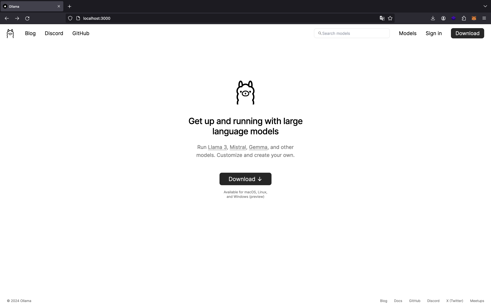
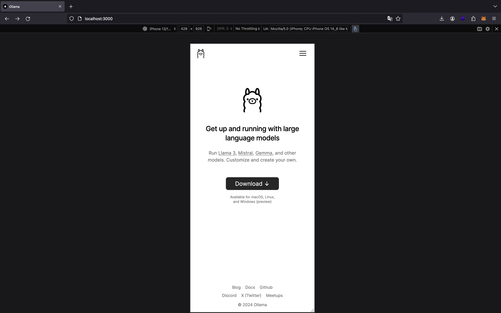
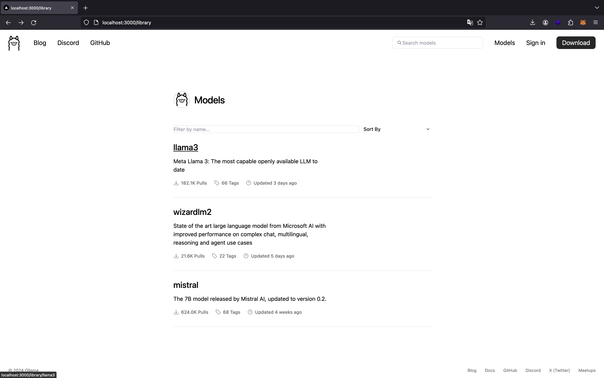
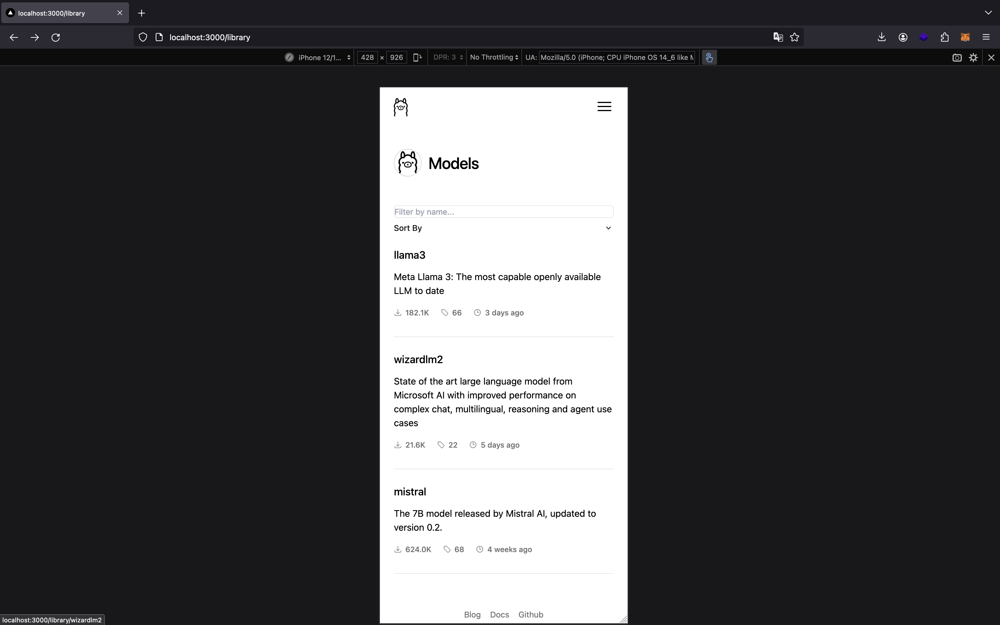
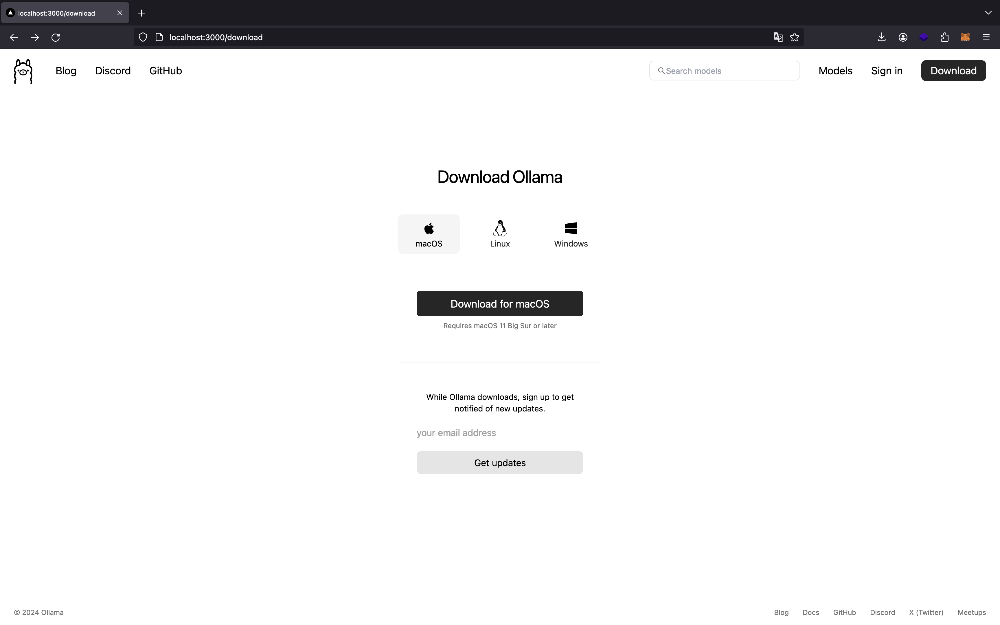
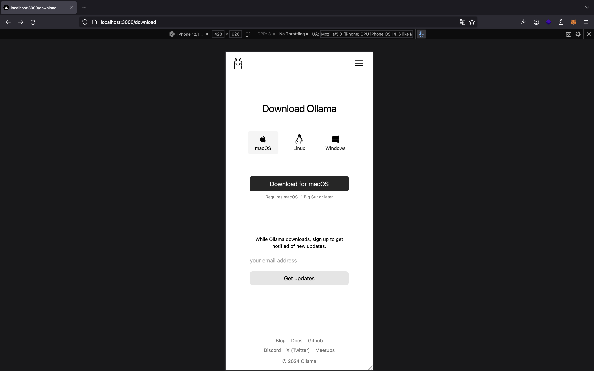

# Ollama Clone

This a clone of Ollama's website. This is part of a series to copy popular webpage designs and implement them for practice.

This clone is built using NextJs with Tailwind CSS and TypeScript.

## UI

### Landing Page
| Large                               | Small                               |
| ----------------------------------- | ----------------------------------- |
|  |  |

### Models List Page
| Large                              | Small                              |
| ---------------------------------- | ---------------------------------- |
|  |  |

### Model Detail Page

### Download Page
| Large                                 | Small                                 |
| ------------------------------------- | ------------------------------------- |
|  |  |

